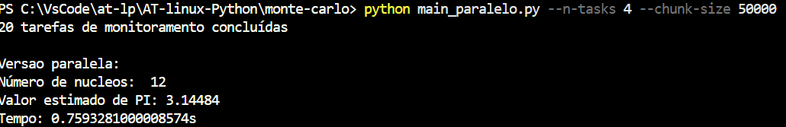
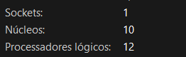
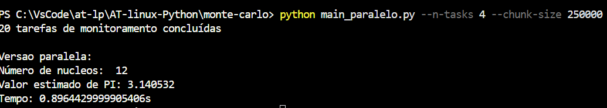
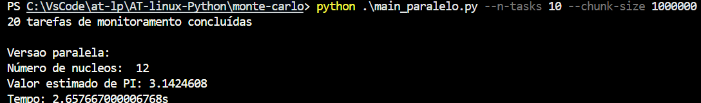
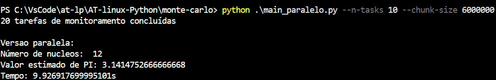
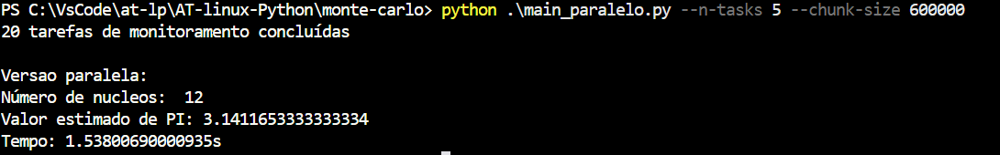

# Monte Carlo

A aproximação de PI foi feita via o método de Monte Carlo, ou seja, distribuindo pontos (hits) aleatórios em um quadrado de lado 2 e verificando os que caem dentro do circulo. É basicamente um quadrado de lado 2 com coordenadas entre -1 e 1 e um círculo perfeito de raio 1 no centro. A máquina gera milhares de pontos (hits) aleatórios (x e y) dentro do quadrado. Em seguida o programa conta quantos hits caíram dentro do círculo. Já o cálculo do PI é a proporção de acertos dentro do círculo multiplicada por 4, que da a aproximação de PI.

## Versão Serial

Como rodar a versão serial

```python
# serial
python main_serial.py
```

O número de processadores é 12 via `os.cpu_count()`, lembrando que são os processadores lógicos, nâo necessariamente a quantidade de núcleos físicos, vide o executor de tarefas.




Calcula o numero total de amostras (n_tasks \* chunk_size) e começa a medir o tempo de execução via `time.perf_counter()`. Nessa função os pontos (hits) são gerados um por um via:

```python
for _ in range(samples):
        x = random.uniform(-1, 1)
        y = random.uniform(-1, 1)
```

Para cada iteração se gera dois valores randômicos (x sendo horizontal e y sendo vertical), e eles formam um ponto no quadrado (entre -1 e 1). Logo após ele verifica se o ponto (hit) está dentro do circulo via:

```python
if x**2 + y**2 <= 1:
            hits += 1
```

Isso é baseado na equação de um círculo com centro na origem e raio 1, e se essa condição for atendida, o contador de hits é incrementado.

Após isso, é retornado o total de pontos que ficaram dentro do circulo.

Se calcula o tempo da execução via:

```python
serial_time = time.perf_counter() - start
```

E ao final de tudo se calcula a estimativa do PI via:

```python
serial_pi = 4 * serial_hits / total
```

Em resumo a versão serial executa tudo em sequencia dentro de um único processo.

## Versão Paralela

Essa versão do algorítimo foi implementada utilizando multiprocessing.Pool ou seja com a divisão do trabalho em blocos (chunks). O objetivo é distribuir a carga de processamento entre vários processos, o que permite que diversas partes da execução sejam executadas de forma simultânea.

A lógica de cálculo é a mesma da primeira versão.

O número de processadores também é 12 via `os.cpu_count()`

saídas com múltiplos valores:










A forma paralela é mais util em execuções com valores maiores pois assim os vários processos rodam simultaneamente com a carga distribuída, o que não é tão vantajoso em execuções mais simples.

Como rodar a versão paralela

```python
# paralela
python main_paralelo.py --n-tasks 10 --chunk-size 250000
```

--n-tasks 4 são os blocos de execução
--chunk-size 250000 são os pontos (hits) por bloco de execução

esses parametros são lidos pelo arquivo `arguments.py`

Foram executadas 20 tarefas assíncronas com asyncio no arquivo `monitoring.py` e os logs gerados em `logger.py` e `system_monitor.py`

## Comparação entre as versões

| Versão   | Tempo total (s) | Valor estimado de π |
| -------- | --------------: | ------------------: |
| Serial   |          1.5582 |            3.140496 |
| Paralela |          1.0154 |            3.138424 |
