# Exercício 2

Criei o Dockerfile com todos os requisitos solicitados, o problema é que meu Notebook não roda o Docker mesmo com a virtualização ativa, então rodei no meu Desktop, porém em uma configuração diferente dos primeiros testes fora do Docker.

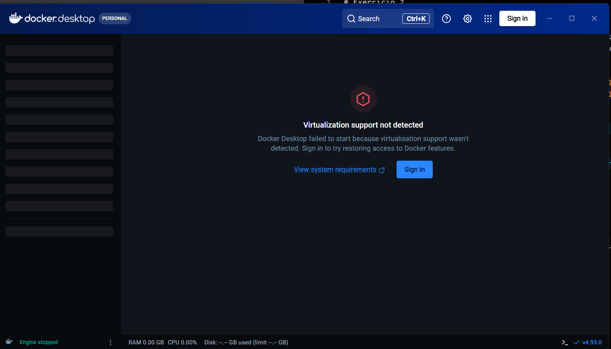


## Monte Carlo Dockerizado

```docker
FROM python:3.13-slim
WORKDIR /app
COPY main_serial.py main_paralelo.py ./
COPY codigo ./codigo
RUN pip install --no-cache-dir psutil
ENTRYPOINT ["python", "main_paralelo.py"]
```

A máquina tem 16 CPUs lógicas (os.cpu_count()), que não correspondem necessariamente aos núcleos físicos. O número real de processos é definido pelo --n-tasks

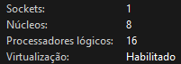

Rodando as versões do Monte Carlo na máquina desktop com os mesmos parametros dos outros testes

Serial:

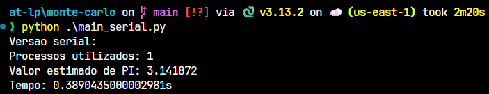

Paralelo:

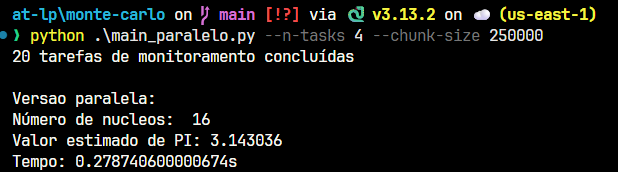

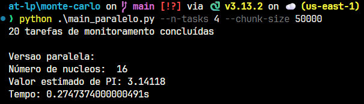

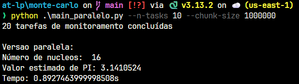

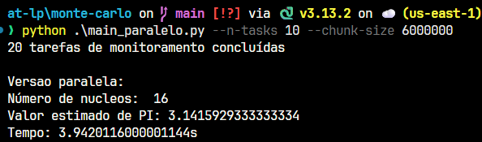

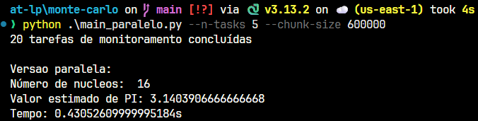

## Comparação entre as versões

| Versão   |     Tempo total (s) | Valor estimado de PI |
| -------- | ------------------: | -------------------: |
| Serial   |  0.4078875829999902 |             3.140412 |
| Paralela | 0.15817545499999142 |             3.139116 |

## Rodando no Docker

O container usa os mesmos 16 CPUs lógicos, porque o Docker Desktop roda um Linux via WSL2 que recebe todos os processadores do host por padrão.

```bash
docker build . -t monte-carlo

# roda o paralelo com coleta dos logs (via volumes) e parametros
docker run --rm --name mc-run -v "$($PWD.Path)/codigo/logs:/app/codigo/logs" monte-carlo --n-tasks 4 --chunk-size 250000
```

O `-v` faz o bind mount de `codigo/logs` do host em `/app/codigo/logs`, que é o
caminho usado pelo `main_paralelo.py

Resultado do paralelo no Docker:

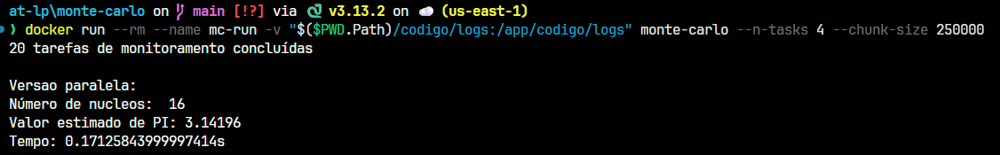

Monitoramento no host, com o container rodando:

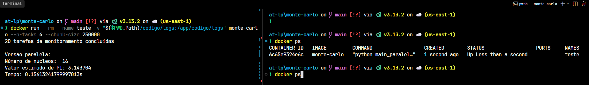

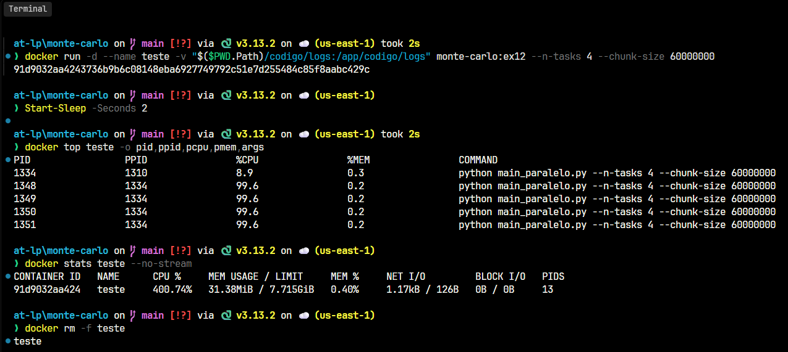

## Arquitetura adotada para conteinerização

A conteinerização usa uma imagem construída a partir de python:3.13-slim,
com o código copiado para /app e a dependência psutil é instalada durante o
build. O container executa o mesmo código do Exercício 11, sem alteração na
lógica do Monte Carlo

A imagem não forca nenhuma config para execução. O volume e os parâmetros
são decididos no momento do docker run

## Como o paralelismo do Exercício 11 se manifesta dentro do container

O paralelismo continua sendo por processos, com multiprocessing.Pool em
monte_carlo_parallel.py. O container não substitui nem interfere no paralelismo.
Cada worker é um processo do Linux completo, com seu
próprio espaço de memória, é por isso que o paralelismo do Exercício 11 funciona no container.

A diferença é de escala de observação. No host cada worker aparece como um
processo Python comum. Dentro do container os workers continuam visíveis, mas
os PIDs são reatribuídos pelo namespace de processos do Linux, e é por isso que
o log interno mostra parent_pid igual a 1 enquanto o docker top no host
mostra o processo principal com PID 1239.

## Diferenças observadas entre a execução nativa (host) e a execução containerizada

| Execução             |     Tempo total (s) | Valor estimado de PI |
| -------------------- | ------------------: | -------------------: |
| Nativa - Serial      |  0.3890435000002981 |             3.141872 |
| Nativa - Paralela    |   0.278740600000674 |             3.143036 |
| Container - Serial   |  0.4078875829999902 |             3.140412 |
| Container - Paralela | 0.15817545499999142 |             3.139116 |

A diferença mais expressiva está na versão paralela: 0.2787s nativo contra
0.1582s no container, uma redução de cerca de 43%. A versão serial praticamente
não mudou, de 0.3890s para 0.4079s, uma diferença de aproximadamente 5%, que
está dentro da variação normal entre execuções.

A explicação para a assimetria é o peso dos custos fixos. Na versão serial não
há criação de processos, e o tempo é quase todo dedicado ao laço de geração de
pontos, que é idêntico nas duas execuções. Na versão paralela o tempo total inclui
criar os processos da Pool, serializar os argumentos e coletar os resultados, e
esse custo fixo representa uma parcela maior do total quando o volume é pequeno.

O paralelismo real continua sendo o mesmo, e isso é confirmado pelo
docker stats: 397.65% de CPU com 4 workers, ou seja, os quatro núcleos estão
ocupados o tempo todo. O ganho de tempo não veio de usar mais CPU, e sim de
menos overhead por execução.

## Impactos do uso de Docker no monitoramento, no isolamento e no consumo de recursos

Por fora o docker ps, docker top e docker stats dão a visão consolidada do
container, e por dentro o psutil dá o detalhe por processo, com PID, CPU e
status. Os dois níveis são complementares. O docker stats mostra o total de
397.65%, e só o docker top mostra que isso se divide em quatro processos de
cerca de 99% cada. Uma limitação real é que os PIDs são diferentes dependendo
do nível, o que exige correlação pelo PPID para identificar o processo principal,
que é o pai de todos os workers.

O container isola o sistema de arquivos, o espaço de processos e
o ambiente Python. O programa não depende da instalação local de Python nem do
psutil do host.

Os workers continuam consumindo CPU e memória reais do
host, como os 397.65% e os 31.39MiB observados.
